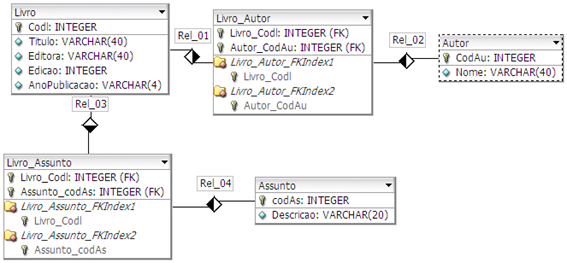

# Biblioteca-rest

## Objetivo
API criada para atender o requisito técnico para a vaga de desenvolvedor java sênior da empresa Spassu.

## Descrição do Projeto
O projeto consiste em um cadastro de livros, sendo que para cada livro deve ter uma lista de um ou mais autores bem como um ou mais assutos.

## Modelo de Dados

## Tecnologias Usadas

<ul>
  <li>Java - 17</li>
  <li>Spring boot - 3.4.2</li>
  <li>Spring Boot Starter Web - 3.4.2</li>
  <li>Spring Boot Starter Data JPA - 3.4.2</li>
  <li>Spring Boot Starter Validation - 3.4.2</li>
  <li>Junit 5.11.4</li>
  <li>Mockito - 5.14.2</li>
  <li>Log4j - 2.24.3</li>
  <li>Lombok - 1.18.36</li>
  <li>PostgreSQL JDBC Driver - 42.7.5</li>
  <li>Jasper Reports - 6.17.0</li>
  <li>iText - 2.1.7</li>
  <li>Roda na porta 8080</li>
</ul>

## Passo a passo para executar a API

### Inicializar a aplicação

[Executar a classe BibliotecaApplication](src/main/java/com/spassu/tj/biblioteca/BibliotecaApplication.java)

### Base de Dados
Para essa api foi utilizada o banco PostgreSQL, sendo necessário executar uma view após iniciar a aplicação. 

#### Baixar Script View
[📥 Baixar scritp da view](src/main/resources/scripts/VwAutoresLivrosAssuntos.sql)

### Endpoints

<ul>
  <li>Chamar o endpoint - http://localhost:8080/api/autores -  POST </li>
  <li>Chamar o endpoint - http://localhost:8080/api/assuntos - POST </li>
  <li>Chamar o endpoint - http://localhost:8080/api/livros - POST </li>
  <li>Chamar o endpoint - http://localhost:8080/api/livros - GET </li>
  <li>Chamar o endpoint - http://localhost:8080/api/relatorios/autores-pdf - GET </li>    
</ul>

### Mais Endpoints
Caso queira realizar o crud das entidades: autor, assunto e livro, você pode baixar o json dos endpoins para ser importado no postman
#### Download do Arquivo JSON
[📥 Baixar arquivo JSON](src/main/resources/postman/Biblioteca-rest.postman_collection.json)

